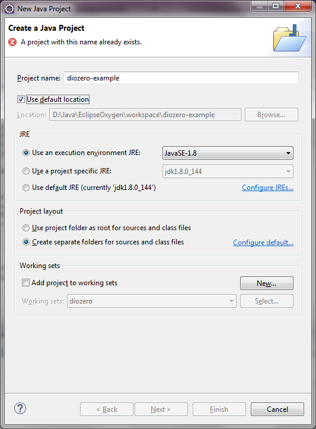
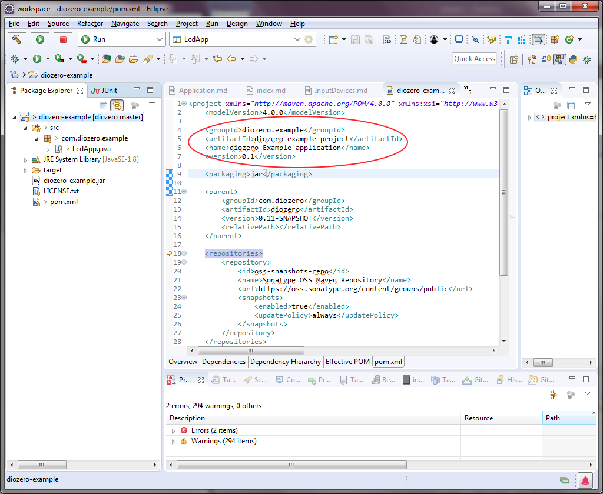
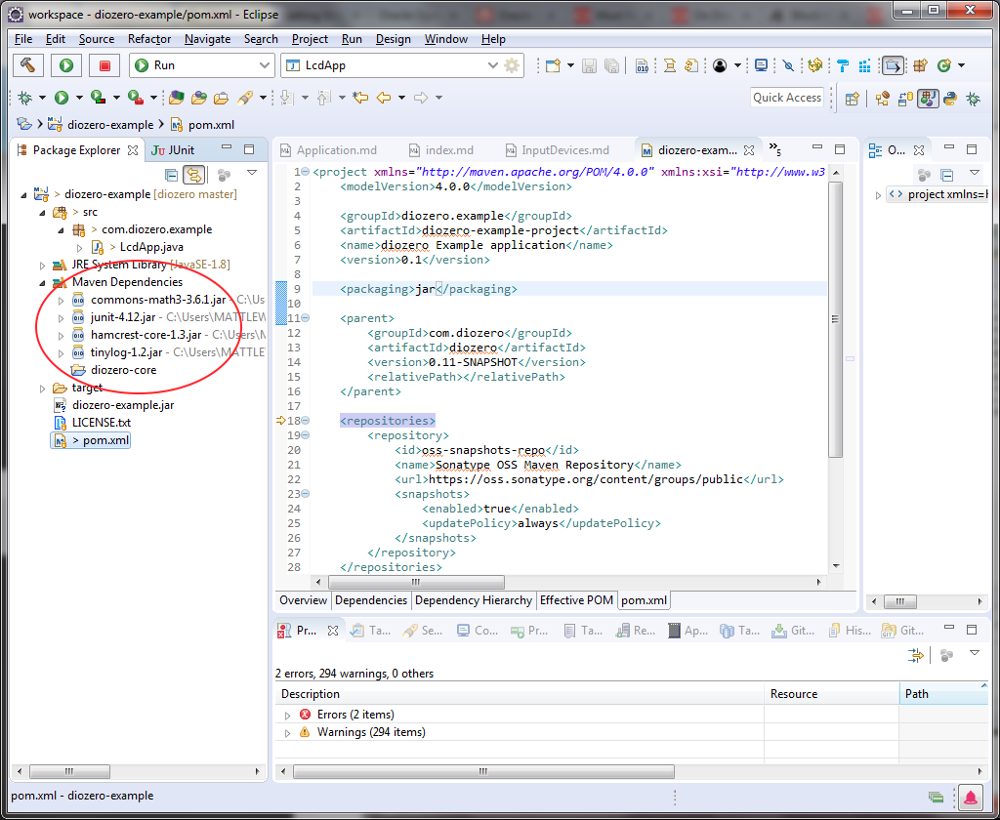
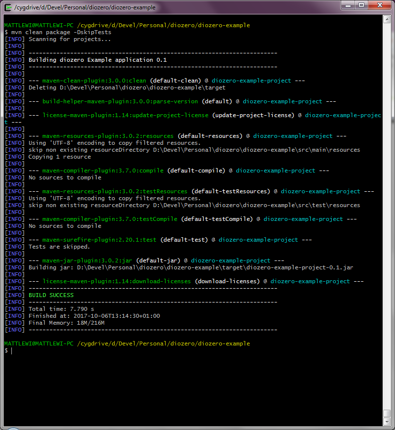

# Creating Your Own diozero Application

If you want to create your own application that uses diozero I recommend that you use Apache Maven to manage dependencies.
Gradle also provides similar functionality however I haven't had chance to look into using it.

There are 2 main approaches for incorporating diozero into your project using Maven

1. Reference diozero as the Maven parent.

    Use [diozero-example](https://github.com/mattjlewis/diozero/blob/master/diozero-example/pom.xml) as a reference.

1. Add diozero as a dependency in your own own Maven pom.xml.

    See my [Java Lego Car](https://github.com/mattjlewis/JavaLegoCar/blob/master/pom.xml) project as an example.

If you want to manage the dependencies yourself, download a diozero distribution ZIP file from [Google Drive](https://drive.google.com/open?id=0BxA10VX9SC74VDR6WTlLOEdpYzA) and add tinylog-1.2.jar and diozero-core.jar to your project's classpath.

## Step-by-step Instructions

These instructions assume you are using Eclipse, Maven and are using diozero as the parent project.

1. Create a new Java Project

    

1. Import [pom.xml](https://github.com/mattjlewis/diozero/blob/master/diozero-example/pom.xml) into your project

1. Change the name and artifactId attributes in your pom.xml

    

1. Right click on your Java project and chose Configure / Convert to Maven Project

1. Validate the Maven dependencies are imported

    

1. Develop your application

1. Compile, package and distribute your application

    
