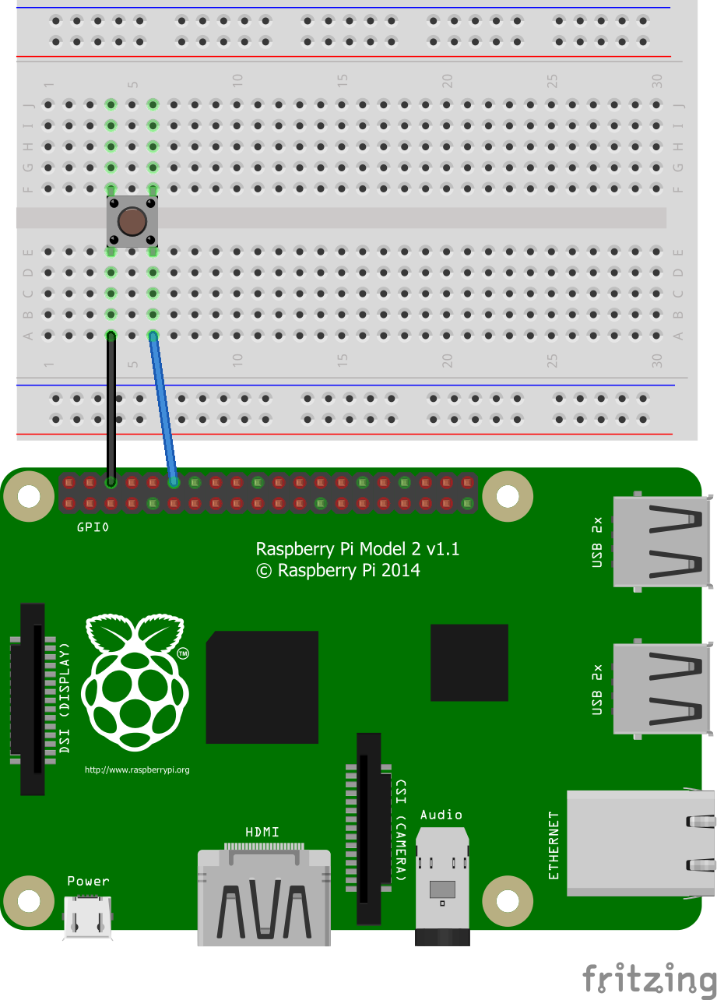

# Input Devices

## Digital Input Devices

### Button

 

Code taken from [ButtonTest](https://github.com/mattjlewis/diozero/blob/master/diozero-core/src/main/java/com/diozero/sampleapps/ButtonTest.java):

```java
try (Button button = new Button(inputPin, GpioPullUpDown.PULL_UP)) {
	button.addListener(event -> Logger.debug("valueChanged({})", event));
	Logger.debug("Waiting for 10s - *** Press the button connected to input pin " + inputPin + " ***");
	SleepUtil.sleepSeconds(10);
}
```

Controlling an LED with a button:

 

Code taken from [ButtonControlledLed](https://github.com/mattjlewis/diozero/blob/master/diozero-core/src/main/java/com/diozero/sampleapps/ButtonControlledLed.java):

```java
try (Button button = new Button(buttonPin, GpioPullUpDown.PULL_UP); LED led = new LED(ledPin)) {
	button.whenPressed(led::on);
	button.whenReleased(led::off);
	Logger.info("Waiting for 10s - *** Press the button connected to pin {} ***", Integer.valueOf(buttonPin));
	SleepUtil.sleepSeconds(10);
}
```

*class* **com.diozero.Button**{: .descname } (*pinNumber*, *pud=NONE*) [source](https://github.com/mattjlewis/diozero/blob/master/diozero-core/src/main/java/com/diozero/Button.java){: .viewcode-link } [&para;](InputDevices.md#button "Permalink to this definition"){: .headerlink }

: Extends [DigitalInputDevice](API.md#digitalinputdevice] to provide push button related utility methods.
    
    * **pinNumber** (*int*) - Pin number for the button.
    
    * **pud** (*GpioPullUpDown*) - Pull up / down configuration (NONE, PULL_UP, PULL_DOWN).
    
    *boolean* **isPressed** ()
    
    : Return true if the button is currently pressed.
    
    *boolean* **isReleased** ()
    
    : Return true if the button is currently released.
    
    **whenPressed** (*action*)
    
    : Action to perform when the button is pressed.
    
    * **action** (*Action*) - Action function to invoke.
    
    **whenReleased** (*action*)
    
    : Action to perform when the button is released.
    
    * **action** (*Action*) - Action function to invoke.


### Motion Sensor

!!! Warning "Work in progress"
    Still under construction hence in the sandpit package.

*class* **com.diozero.sandpit.MotionSensor**{: .descname } (*pinNumber*, *threshold=10*, *eventAge=50*, *eventDetectPeriod=50*) [source](https://github.com/mattjlewis/diozero/blob/master/diozero-core/src/main/java/com/diozero/sandpit/MotionSensor.java){: .viewcode-link } [&para;](InputDevices.md#motionsensor "Permalink to this definition"){: .headerlink }

: Extends [SmoothedInputDevice](API.md#smoothedinputdevice] and represents a passive infra-red (PIR) motion sensor like the sort found in the [CamJam #2 EduKit](http://camjam.me/?page_id=623).
    
    * **pinNumber** (*int*) - The GPIO pin which the motion sensor is attached.
    
    * **threshold** (*int*) - The value above which the device will be considered "on".
    
    * **eventAge** (*int*) - The time in milliseconds to keep active events in the queue.
    
    * **eventDetectPeriod** (*int*) - How frequently to check for events.


## Analog Input Devices

### TMP36

*class* **com.diozero.TMP36**{: .descname } (*pinNumber*, *vRef*, *tempOffset*) [source](https://github.com/mattjlewis/diozero/blob/master/diozero-core/src/main/java/com/diozero/TMP36.java){: .viewcode-link } [&para;](InputDevices.md#tmp36 "Permalink to this definition"){: .headerlink }

: Extends [AnalogInputDevice](API.md#analoginputdevice] for reading temperature values from a [TMP36 Temperature Sensor by Analog Devices](http://www.analog.com/en/products/analog-to-digital-converters/integrated-special-purpose-converters/integrated-temperature-sensors/tmp36.html).
    
    * **pinNumber** (*int*) - Pin number on the ADC device.
    
    * **vRef*** (*float*) - Voltage range for the ADC - essential for scaled readings.
    
    * **tempOffset*** (*float*) - Compensate for potential temperature reading variations between different TMP36 devices.
    
    *float* **getTemperature** ()
    
    : Get the current temperature in &deg;C.


### Potentiometer

Generic [potentiometer](https://en.wikipedia.org/wiki/Potentiometer).

TODO Wiring diagram.

*class* **com.diozero.Potentiometer**{: .descname } (*pinNumber*, *vRef*) [source](https://github.com/mattjlewis/diozero/blob/master/diozero-core/src/main/java/com/diozero/Potentiometer.java){: .viewcode-link } [&para;](InputDevices.md#potentiometer "Permalink to this definition"){: .headerlink }

: Extends [AnalogInputDevice](API.md#analoginputdevice] for taking readings from a potentiometer.
    
    * **pinNumber** (*int*) - Pin to which the potentiometer is connected.
    
    * **vRef** (*float*) - Reference voltage.

    *float* **getVoltage** ()
    
    : Read the potentiometer output voltage value.


### LDR

*class* **com.diozero.LDR**{: .descname } (*pinNumber*, *vRef*, *r1*) [source](https://github.com/mattjlewis/diozero/blob/master/diozero-core/src/main/java/com/diozero/LDR.java){: .viewcode-link } [&para;](InputDevices.md#ldr "Permalink to this definition"){: .headerlink }

: Extends [AnalogInputDevce](API.md#analoginputdevice). Generic [Photoresistor / Light-Dependent-Resistor (LDR)](https://en.wikipedia.org/wiki/Photoresistor).
    
    * **pinNumber** (*int*) - Pin to which the LDR is connected.
    
    * **vRef** (*float*) - Reference voltage.
    
    * **r1** (*float*) - Resistor between the LDR and ground.

    *float* **getLdrResistance** ()
    
    : Read the resistance across the LDR.

    *float* **getLuminosity** ()
    
    : Read the current luminosity.
    
    !!! warning "Not yet implemented"
        This operation currently just returns the resistance across the LDR.


### Sharp GP2Y0A21YK Distance Sensor

[Sharp GP2Y0A21YK](http://www.sharpsma.com/webfm_send/1208) Distance Sensor.

*class* **com.diozero.GP2Y0A21YK**{: .descname } (*pinNumber*) [source](https://github.com/mattjlewis/diozero/blob/master/diozero-core/src/main/java/com/diozero/GP2Y0A21YK.java){: .viewcode-link } [&para;](InputDevices.md#sharp-gp2y0a21yk-distance-sensor "Permalink to this definition"){: .headerlink }

: Extends [AnalogInputDevice](API.md#analoginputdevice] for taking object proximity readings.
    
    *float* **getDistanceCm** ()
    
    : Read distance in centimetres, range 10 to 80cm.
    